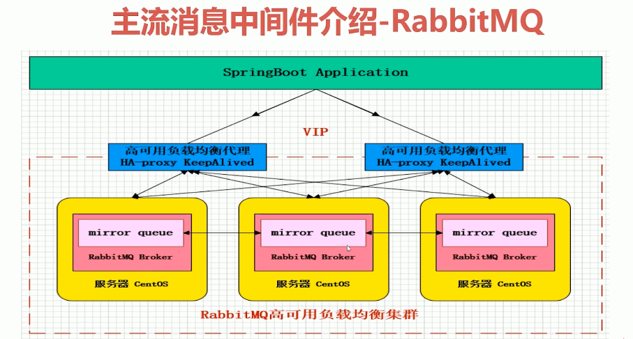
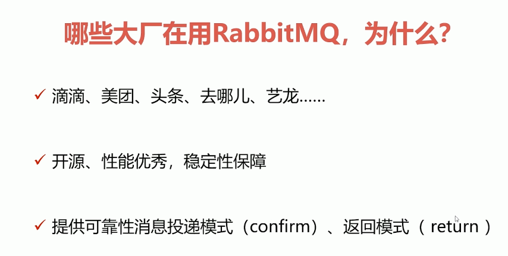
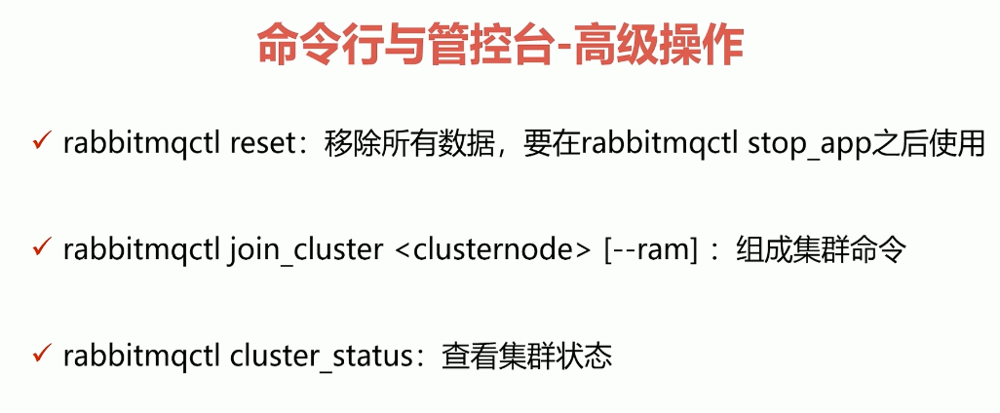
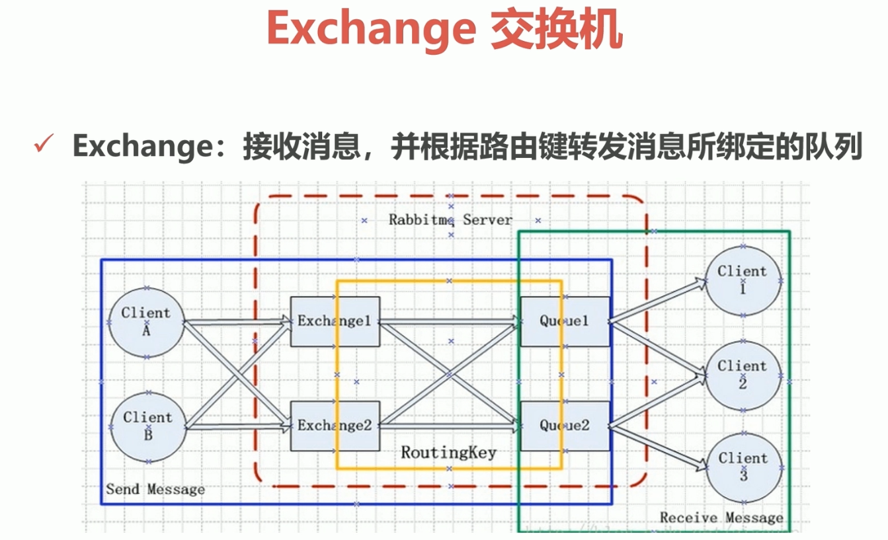
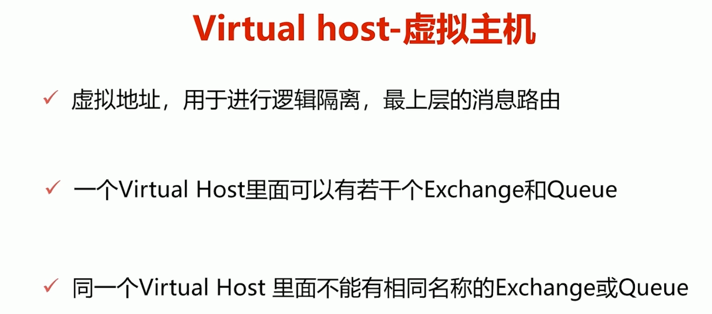

### 主流消息中间件特点、架构、原理、底层机制

MQ衡量指标：服务性能、数据存储、集群架构

ActiveMQ的Apache出品，一度十分流行的、能力强劲的开源消息总线，并且它是一个完全支持JMS规范的消息中间件。丰富的API、多重集群构建模式使其成为业界老牌的消息中间件，在中小型企业中广泛应用。

ActiveMQ的集群架构模式

Master-Slave模式：

通过Zookeeper对多个节点进行协调，这里的多个节点通常只有一个主节点对外提供服务，其他的节点启动但不对外提供服务，当主节点宕机后，提升从节点为主节点对外提供服务。

NetWork模式：

通常是两组Master-Slave模式，中间通过NetWork网关进行连接配置，实行分布式的配置

Kafka（关注吞吐量）：

LinkedIn开源的分布式发布-订阅消息系统，目前归属于Apache顶级项目。Kafka主要特点是基于Pull的模式来处理消息消费，追求高吞吐量，一开始的目的就是用于日志收集和传输。0.8版本开始支持复制，不支持事务，对消息的重复、丢失、错误没有严格要求，适合产生大量数据的互联网服务的数据收集业务。

高效读写基于底层的page cache

### 核心概念与基础API应用，并结合高并发业务场景应用

#### AMQP协议模型解析

#### 环境搭建、极速入门

lsof -i:5672 验证

声明队列的时候注意 durable（持久化），exclusive（独占资源）

#### 命令行，管控台最佳使用

#### Exchange Bingding Queue

#### Virtual Host RoutingKey

类似redis的16个db 逻辑上

### 高级特性，巧妙服务于你的应用服务、架构设计

#### 可靠性投递解析

#### 消息幂等操作解析

#### Confirm确认机制，Return返回机制解析

#### 自定义消息，QOS限流策略解析

#### ACK，重回队列解析

#### TTL消息，死信队列解析

### 与Spring家族整合，更高效的实现MQ与应用服务的集成

#### SpringAMQP管理、消息模版

#### SpringAMQP监听容器

#### SpringAMQP适配器 、转化器

#### RabbitMQ与SpringBoot2.x整合实战

#### RabbitMQ与Spring Cloud Stream整合实战

#### 最佳使用心得、技巧

### 集群架构、构建高可靠消息中间件

#### 架构模式 - 主备，远程，镜像，多活

#### 镜像队列实现可靠性存储

#### 高可用组件KeepAlived整合

#### 负载均衡组件HaProxy整合

#### 5种故障恢复与故障转移的解决方案

#### 集群插件安装与使用

### 互联网大厂的架构设计思路，SET化架构设计思想

#### 单个大集群架构 > 同城双活 > 两地三中心

#### SET化架构设计策略

#### SET化架构设计原则

#### RabbitMQ异地多活架构

#### RabbitMQ多集群路由策略

#### SET化中间件设计与实现

### 大厂流行的基础组件设计思路

#### 一线大厂MQ组件实现思路和架构设计思路

#### 迅速消息，确认消息

#### 批量消息，延迟消息

#### 顺序消息，事务消息

#### 消息幂等性保障 

#### 消息路由规则架构

多个集群的数据同步通过federation

不同编程语言在多核cpu上的执行展示，可视化

