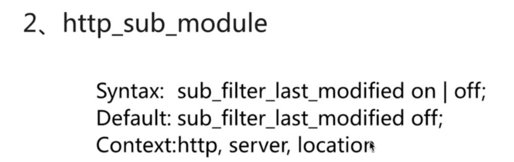

中间件的必要性以及在现代编程语言中如何在该层面中抽象出来

首先是定义，它是个什么？

高效（海量的并发请求）可靠的中间件

优势：

#### IO多路复用epoll 


多线程方式

todo 是否类似select的 监听一个不同IO的状态，谁返回了就直接处理，类似一种上报的机制


内核维护更新列表

select的缺点：

能够坚实文件描述符的数量存在最大限制

线性扫描效率低下


#### 轻量级

功能模块少

代码模块化  只保留核心模块 其他通过插件来安装

#### CPU亲和（affinity）

是一种把CPU核心和Nginx工作进程绑定的方式，把每个worker进程固定在一个cpu上执行，减少切换cpu的cache miss，获得更好的性能。

#### sendfile


### 基础篇

#### 快速安装

确保系统网络、yum可用，关闭IPtables规则并停用SElinux

安装依赖

```bash
yum -y install gcc gcc-c++ autoconf pcre pcre-devel make automake
yum -y install wget httpd-tools vim
```

查看并关闭IPtables

```shell
iptables -L
iptables -F
iptables -t nat -L
iptables -t nat -F
```

 查看并关闭SElinux

```
getenforce
#use this to make sure SElinux Disabled
setenforce 0
```

nginx版本说明：

mainline  version  开发版

stable version  稳定版

legacy version

通过yum源安装

一个个的rpm包  通过命令rpm  -ql nginx来查看

todo 通过docker安装


#### 配置语法


重启nginx服务

systemctl restart nginx.service

systemctl reload nginx.service


curl -v www.baidu.com >/dev/null

#### log


如User-Agent  需要记录则需要添加为 $http_user_agent

nginx -t -c /etc/nginx/nginx.conf    检查配置文件是否正确

nginx -s reload -c /etc/nginx/nginx.conf 重新加载配置

直接输入nginx 就可以开启了

tail -n 200 /var/log/nginx/access.log

http://nginx.org/en/docs/syslog.html

#### 默认模块

通过nginx -V查看后  --with之后

  


```
 location /status {
        stub_status;
 }
```

```
Active connections: 2 
server accepts handled requests
 握手总次数 处理的连接数 请求数 
Reading: 0 Writing: 1 Waiting: 1 （开启keep alive）
```


systemctl reload nginx





on 只匹配一次


#### 访问限制

##### HTTP的请求和连接


##### 请求的限制和连接的限制


##### access模块配置语法


开辟一个空间来存储


binary设置的是关于字节等的定义， rate 限制1r/s

ab -n 50 -c 20 url

50个请求 20个并发

burst = 3 保留3个加入队列 延迟响应 其他丢弃

##### 请求限制的局限性

多个请求放在一个连接里

##### 基本安全认证


后台的一些配置 只允许某个ip或者某个网段的ip


解决的一种方式


头信息可以被修改 

##### auth模块配置语法

登陆认证模块


```
rpm -qf /usr/bin/htpasswd

yum install httpd-tools -y
#gen pwd
htpasswd -c ./auth_conf aaron
```


输入用户密码可以预防暴力破解吗？  可以加上流控预防

##### 安全认证局限性


### 场景实践

#### 静态资源WEB服务

什么是静态资源

服务场景

服务配置

客户端缓存

资源压缩

防盗链

跨域访问

#### 代理服务

#### 负载均衡

#### 缓存服务

### 深度学习

#### 动静分离

#### rewrite规则

#### HTTPS服务

HTTPS协议

配置语法

苹果要求的https服务

#### nginx与lua开发

#### 模块配置

### 架构篇

#### 常见问题

#### 性能优化

调适性能优化

性能的影响因素

操作系统性能优化

#### 安全相关

#### 其他特性

#### 架构设计

